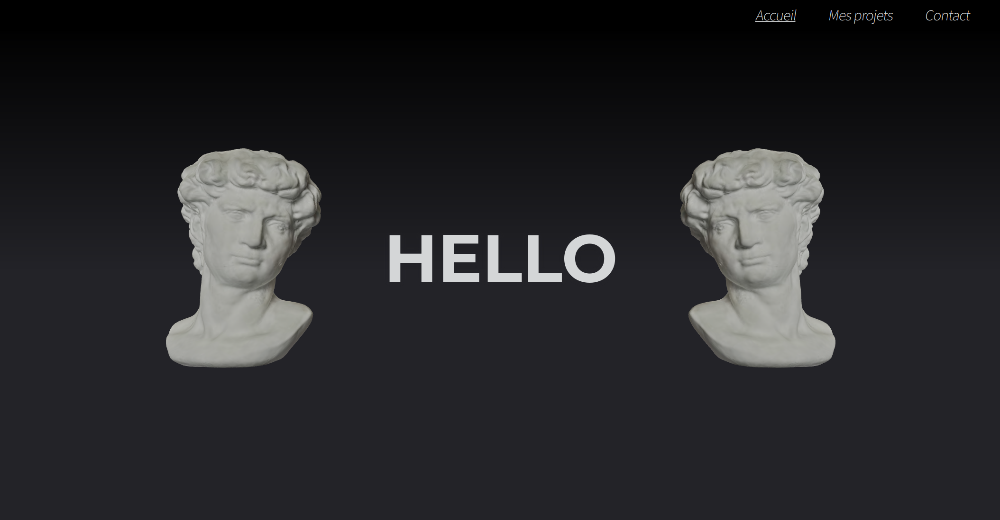

# [matthiasg.dev](https://matthiasg.dev)

Personnal website/portfolio hosted on a raspberry pi.

This is the source code of my new website, the code on the website is the old one.

The project is build using [svelte](https://svelte.dev/).

## State of the project

The design has finished, I will first make the homepage.

## Other

If you (for any reason) want to help, feel free to do it...
But keep in mind that this is my first project with svelte and typescript.

## Cloning

Once you cloned the repo, you need to add a `.env` file at the root of the project with a `DISCORD_WEBHOOK` constant that contains the end of a [discord webhook](https://discord.com/developers/docs/resources/webhook) url (`DISCORD_WEBHOOK="123456789101112131415161718/randomLettersNumbersAndCharachters"`)

You will also need to put a `VITE_ACKEE_DOMAIN` and a `VITE_ACKEE_ACTION__REACHED_CONTACT` id. [Ackee](https://ackee.electerious.com/) is a self-hosted tracker that respect privacy. I use it to get data about the visits on the site and `VITE_ACKEE_ACTION__REACHED_CONTACT` is a custom action that triggers when someone reach the end of the homepage.
